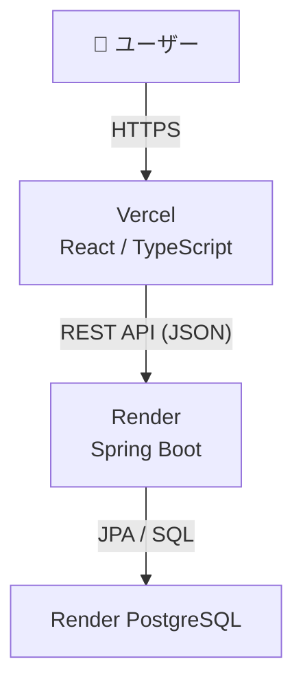
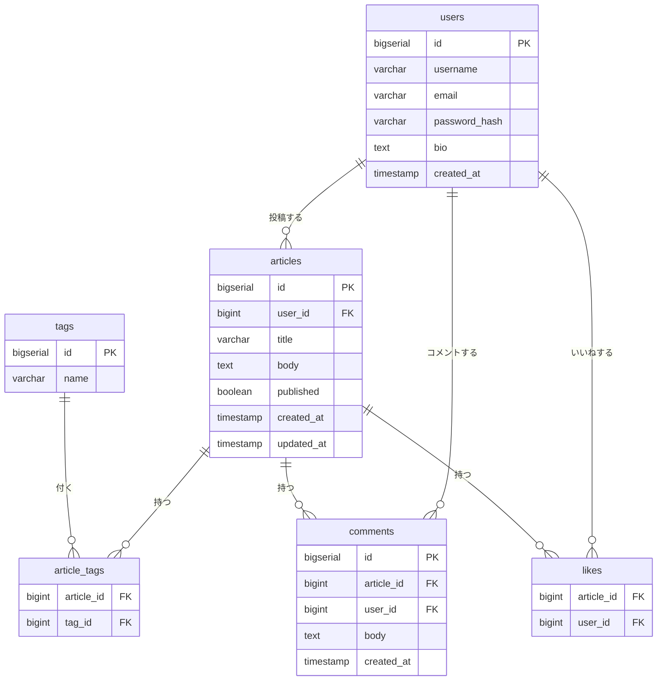

# Maneta

> **技術記事投稿サービス。Qiitaにインスパイアされた個人開発ポートフォリオ。**

🔗 **デプロイURL**: [https://maneta-ten.vercel.app](https://maneta-ten.vercel.app)  
🐙 **GitHub**: [https://github.com/yourname/maneta](https://github.com/yourname/maneta)

---

## 📌 このプロジェクトについて
転職用ポートフォリオとして開発した、Qiita風の技術記事投稿サービスです。
Spring BootでREST APIを設計・実装し、ReactでSPAのフロントエンドを構築しました。
JWT認証やDockerによる環境構築など、モダンなWeb開発の技術スタックを実践的に習得することを目的としています。
---

## 🛠 使用技術

| レイヤー | 技術 |
|----------|------|
| バックエンド | Java 21 / Spring Boot 3 / Spring Security / JPA（Hibernate） |
| フロントエンド | React / TypeScript / Tailwind CSS |
| DB | PostgreSQL 15 |
| 開発環境 | Docker / Docker Compose |
| デプロイ | Render（バックエンド + DB） / Vercel（フロントエンド） |

---

## ✅ 実装機能

### 必須機能
- ユーザー登録 / ログイン / ログアウト（JWT認証）
- 記事投稿 / 編集 / 削除
- 記事一覧 / 記事詳細
- 自分の記事だけ編集・削除できる権限制御

### 追加機能
- タグ付け / タグ検索
- いいね / いいね解除（重複防止）
- コメント投稿・一覧表示
- ページング
- エラーレスポンスの統一（GlobalExceptionHandler）

---

## 🏗 システム構成図



---

## 🗂 ER図



---

## 💡 工夫した点

---

## 😤 苦労した点


---

## 🚀 ローカル起動手順

### 前提条件
- Docker Desktop がインストールされていること
- Java 21 以上
- Node.js (LTS)

### 1. リポジトリのクローン

```bash
git clone https://github.com/Ryoji-Nakao/maneta.git
cd maneta
```

### 2. DBの起動（Docker）

```bash
docker compose up -d
```

### 3. バックエンドの起動

```bash
cd backend
./gradlew bootRun
```

> `http://localhost:8080` で起動します。

### 4. フロントエンドの起動

```bash
cd frontend
npm install
npm run dev
```

> `http://localhost:5173` でブラウザが開きます。

---

## 📡 主なAPIエンドポイント

| メソッド | パス | 認証 | 説明 |
|----------|------|------|------|
| POST | /api/auth/register | 不要 | 会員登録 |
| POST | /api/auth/login | 不要 | ログイン（JWT返却） |
| GET | /api/articles | 不要 | 記事一覧（ページング） |
| GET | /api/articles/{id} | 不要 | 記事詳細 |
| POST | /api/articles | 必要 | 記事投稿 |
| PUT | /api/articles/{id} | 必要（本人） | 記事編集 |
| DELETE | /api/articles/{id} | 必要（本人） | 記事削除 |
| GET | /api/articles?tag=java | 不要 | タグ検索 |
| POST | /api/articles/{id}/likes | 必要 | いいね |
| DELETE | /api/articles/{id}/likes | 必要 | いいね解除 |
| GET | /api/articles/{id}/comments | 不要 | コメント一覧 |
| POST | /api/articles/{id}/comments | 必要 | コメント投稿 |

---

## 👤 作者

- GitHub: [@Ryoji-Nakao](https://github.com/Ryoji-Nakao)
